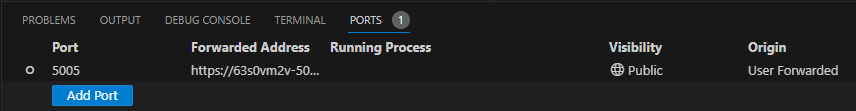

# VSCodeで𝕏/TwitterのURLカード脆弱性を確認する環境を構築する

VS Code Meetup #28

cssho / Sho Sato

<!--
_header: ""
-->
---
## 自己紹介
cssho / Sho Sato

- GitHub: [cssho](https://github.com/cssho)
- X(Twitter): [@csshooo](https://twitter.com/csshooo)
- 所属: 株式会社ヒューマンテクノロジーズ


---
## 今日のポイント

- 𝕏/TwitterのURLカード脆弱性
  - URLカードに表示されているドメインとは異なるドメインにアクセサさせることができる
  - [X (旧Twitter)のURLカードに致命的な脆弱性。うかつに開かないで | ニッチなPCゲーマーの環境構築Z](https://www.nichepcgamer.com/archives/x-twitter-url-card-critical-vulnerability.html)
- [Local Port Forwarding](https://code.visualstudio.com/docs/editor/port-forwarding)
  - [Microsoft dev tunnels](https://learn.microsoft.com/ja-jp/azure/developer/dev-tunnels/overview) を介してローカルのWebサービスをインターネット上に公開できる

---
## 用意するもの
- VSCode
- GitHubアカウント
- 𝕏/Twitterアカウント
- ローカルで動かせるWebサービス

---
## リダイレクトサーバー
今回はC#で書いてみます
```csharp
var builder = WebApplication.CreateBuilder(args);
var app = builder.Build();

app.MapGet("/", (HttpRequest request) =>
 TypedResults.Redirect(
    // TwitterbotからはGitHubのプロフィールページ
    request.Headers.UserAgent == "Twitterbot/1.0" ? "https://github.com/cssho"
        // その他からは警察庁のフィシング対策のページ
        : "https://www.npa.go.jp/bureau/cyber/countermeasures/phishing.html")
);
app.Run();
```
---
## デモ
実際にやってみましょう
（本当はデモもVSCode内で完結したかった）

---
## おさらい
### Local Port Fowardingの設定



1. `Foward a Port` から設定追加
2. ローカルで動作しているサーバーのポートを入力
3. `Visibility` を `Public` に変更
   - `Private` の場合、初回登録したGitHubアカウントでのみアクセス可能（らしい）